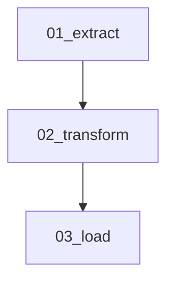

# DAB Workflow Template - Gemini CLI Instructions

This file provides instructions for Google Gemini CLI to work with the Databricks Asset Bundle workflow template.

## Project Overview

This project provides a template for creating, testing, and deploying Databricks workflows using notebooks. It leverages Databricks Asset Bundles (DAB) for infrastructure-as-code workflow management with serverless compute.

## Available Skills

The following skills are available in `.claude/skills/` and can be used by referencing their instructions:

### 1. databricks-asset-bundle

**Purpose**: Generate DAB configurations from notebooks with task dependencies

**When to use**: Setting up Databricks workflows, creating jobs with task dependencies, converting pipelines to DAB

**Key commands**:
```bash
# Generate DAB from text description
scripts/generate_dab.py my_pipeline \
  -d "extract: src/extract.py
      transform: src/transform.py [depends_on: extract]
      load: src/load.py [depends_on: transform]"

# Generate DAB from Mermaid diagram
scripts/generate_dab.py my_pipeline --mermaid-file workflow.mermaid

# Deploy and run
databricks bundle validate -t dev
databricks bundle deploy -t dev
databricks bundle run -t dev <job_name>
```

**Generated structure**:
```
my_pipeline/
├── databricks.yml           # Main bundle configuration
├── resources/
│   └── my_pipeline.job.yml  # Job definition with tasks
├── src/                     # Source code
├── tests/                   # Unit tests
├── run_workflow.sh          # Deployment script
└── README.md
```

### 2. mermaid-diagrams-creator

**Purpose**: Create workflow visualizations and architecture diagrams

**When to use**: Visualizing workflows, creating architecture diagrams, documenting pipelines

**Key commands**:
```bash
# Check if mermaid CLI is installed
mmdc --version

# Install if needed
npm install -g @mermaid-js/mermaid-cli

# Generate image from mermaid file
mmdc -i diagram.mermaid -o diagram.png -b white

# Generate SVG (scalable)
mmdc -i diagram.mermaid -o diagram.svg
```

**Supported diagram types**:
- Flowchart (workflows, processes)
- Sequence Diagram (API calls, interactions)
- Class Diagram (OOP structures)
- ER Diagram (database schemas)
- State Diagram (lifecycles, FSMs)
- Gantt Chart (timelines)

**Important**: Always create BOTH `.mermaid` source file AND image file (PNG/SVG).

### 3. pytest-test-creator

**Purpose**: Generate comprehensive unit tests for Python code

**When to use**: Creating tests, setting up pytest, analyzing test coverage

**Key commands**:
```bash
# Install test dependencies
uv add --dev pytest pytest-cov pytest-mock

# Run tests with coverage
uv run pytest --cov=src --cov-report=html --cov-report=term-missing

# Generate test templates
python scripts/generate_tests.py <source_file>
```

**Test generation patterns**:
```python
# Basic test
def test_function_name_normal_case():
    result = function_name(valid_input)
    assert result == expected_output

# Parametrized test
@pytest.mark.parametrize("input,expected", [(1, 2), (5, 10)])
def test_function_with_multiple_inputs(input, expected):
    assert function_name(input) == expected

# Exception test
def test_function_raises_error_on_invalid_input():
    with pytest.raises(ValueError):
        function_name(invalid_input)
```

### 4. python-code-formatter

**Purpose**: Format Python code for consistency

**When to use**: Formatting code, fixing style issues, preparing for CI/CD

**Key commands**:
```bash
# Install formatters
uv add --dev black isort blackbricks ruff

# Format Databricks notebooks (preserves cell structure)
uv run blackbricks <notebook.py>

# Format regular Python files
uv run isort <file.py>
uv run black <file.py>

# Lint and auto-fix all files
uv run ruff check --fix <file_or_directory>
```

**File type detection**:
- Databricks notebooks (start with `# Databricks notebook source`): Use `blackbricks`
- Regular Python files: Use `isort` then `black`
- All files: Use `ruff` for linting

## Complete Workflow

Follow these steps to create a Databricks workflow:

### Step 1: Create Workflow Diagram

Create a Mermaid flowchart for your workflow:



Save as `.mermaid` file and generate PNG:
```bash
mmdc -i workflow.mermaid -o workflow.png -b white
```

### Step 2: Generate Databricks Asset Bundle

```bash
scripts/generate_dab.py my_pipeline --mermaid-file workflow.mermaid
```

Or from text description:
```bash
scripts/generate_dab.py my_pipeline \
  -d "extract: notebooks/01_extract.py
      transform: notebooks/02_transform.py [depends_on: extract]
      load: notebooks/03_load.py [depends_on: transform]"
```

### Step 3: Create Unit Tests

```bash
# Generate test templates
python scripts/generate_tests.py src/

# Run tests with coverage
uv run pytest --cov=src --cov-report=term-missing
```

### Step 4: Format Code

```bash
# Format all Python files
python scripts/format_code.py .

# Or manually:
uv run blackbricks notebooks/  # Databricks notebooks
uv run isort src/ tests/       # Sort imports
uv run black src/ tests/       # Format code
uv run ruff check --fix .      # Lint
```

### Step 5: Deploy and Run

```bash
# Validate bundle
databricks bundle validate --profile <PROFILE> --target dev

# Deploy
databricks bundle deploy --profile <PROFILE> --target dev

# Run workflow
databricks bundle run --profile <PROFILE> --target dev <JOB_NAME>
```

### Step 6: Document

Update README with:
- Workflow description
- Workflow diagram image
- Deployment instructions
- Configuration variables

## Project Structure

```
.
├── .claude/
│   ├── skills-repo/          # Git submodule with skill definitions
│   ├── skills/               # Symlinks to active skills
│   └── project-context.md    # Project context
├── docs/                     # Project documentation
├── src/                      # Shared Python utilities
├── tests/                    # Test files
├── notebooks/                # Databricks notebooks
├── configs/                  # Configuration files
├── pyproject.toml           # Python project config (uv)
├── CLAUDE.md                # Claude Code instructions (if present)
├── AGENTS.md                # Codex CLI instructions
├── GEMINI.md                # This file - Gemini CLI instructions
└── README.md
```

## Configuration Reference

### pyproject.toml
```toml
[tool.pytest.ini_options]
testpaths = ["tests"]
python_files = ["test_*.py"]
addopts = ["--strict-markers", "-ra"]

[tool.coverage.run]
source = ["src"]
omit = ["*/tests/*"]

[tool.black]
line-length = 100
target-version = ['py311']

[tool.isort]
profile = "black"
line_length = 100

[tool.blackbricks]
line_length = 100

[tool.ruff]
line-length = 100
target-version = "py311"

[tool.ruff.lint]
select = ["E", "W", "F", "I", "B", "C4", "UP"]
```

### databricks.yml Variables
```yaml
variables:
  catalog:
    description: Unity Catalog name
    default: main
  schema:
    description: Schema name
    default: my_schema
  source_path:
    description: Source data path
    default: /Volumes/${var.catalog}/${var.schema}/source
```

## Notes for Gemini CLI

- Skill definitions are in `.claude/skills/` directory (symlinks to `.claude/skills-repo/`)
- Read the SKILL.md files for detailed instructions on each skill
- Use `uv` for Python package management (fast, modern)
- Databricks CLI must be configured with workspace profiles
- Always generate both source (.mermaid) and image files for diagrams
- Use serverless compute by default for Databricks jobs
- Databricks notebooks have special markers (`# COMMAND ----------`) - use `blackbricks` to preserve them
